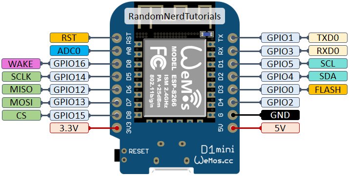

# GPS-Compass Module with Casing

For Autopilots and other robotic projects. Test setup with Wemos D1 (ESP8266).

# Connections

## UBlox Neo-6M

	TX  => D7
	RX  => D6
	5V  => 5V
	GND => GND
	
## Compass

	SDA  => D2
	SCL  => D1
	VCC  => 5V
	GND => GND

Author: cmb87
